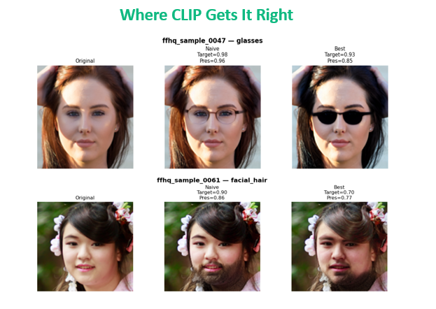
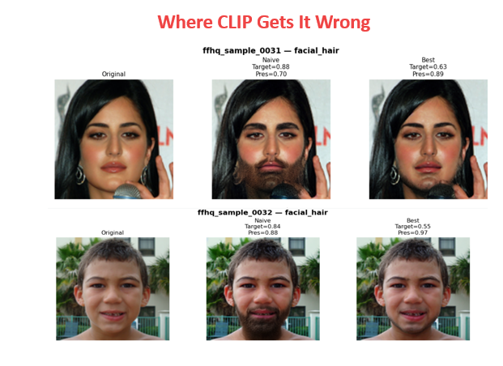
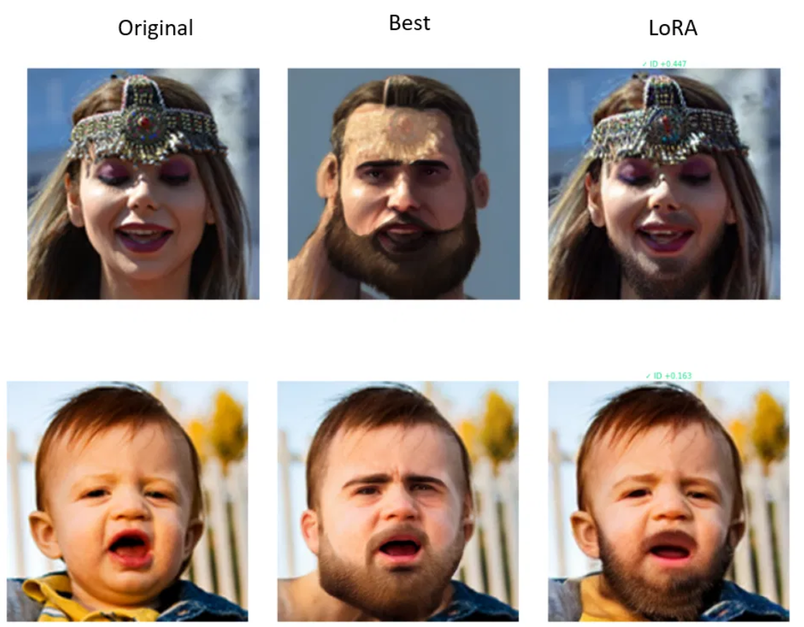

# Zero-Shot Face Edit Generalization

Studying prompt strategies for zero-shot face edits with InstructPix2Pix, then recovering
failure cases with LoRA fine-tuning and structure-preserving latent injection.

## Overview

This project explores how well InstructPix2Pix generalizes when adding glasses and facial
hair to face images, and what happens when it fails — excessive/unnatural edits, identity
loss, or visual hallucinations are common failure modes for prompt-based image editing models.

1. Sample FFHQ images
2. Manually label glasses/facial-hair attributes
3. Build a balanced Phase 1 set
4. Test four prompt strategies
5. Annotate failure modes
6. Select the strongest prompt from Phase 1
7. Compare naive vs. best prompt on a larger clean-image set (CLIP scoring + human pairwise annotation)
8. Isolate remaining facial-hair failures and fine-tune a LoRA adapter on hand-picked successful edits
9. Grid-search LoRA hyperparameters and pick the best checkpoint by identity-preservation scoring
10. Prototype structure-preserving latent injection as an alternative fix, tuned via a pilot grid search
11. Compare original vs. best-prompt vs. LoRA vs. latent injection to evaluate final recovery quality

## Key findings

- **Prompt strategy matters a lot.** For glasses, identity-anchored prompts performed best;
  for facial hair, region-descriptive prompts worked best. Prompts with heavy negative
  constraints tended to underperform, likely because they over-restrict the model.
- **CLIP is useful but limited.** It correlates reasonably with human judgment but doesn't
  reliably capture realism — it sometimes favors stronger edits even when they distort identity.
  Human/CLIP agreement was ~68% for identity preservation and ~65% for overall preferred edit.
- **LoRA fine-tuning was the most effective recovery method.** Using just 10 positive
  facial-hair examples and a small hyperparameter grid search (best config: r=8, α=8), LoRA
  improved identity-preservation scores by ~0.19 on average (up to +0.6 in the best cases),
  fixing many hallucination/over-editing failures — though some identity drift and
  under-editing still remained.
- **Latent injection (Jeong et al.-inspired) was a promising but weaker alternative.** Injecting
  source-image structure into the first ~30% of denoising steps preserved structure without
  retraining, but results were similar to or slightly worse than LoRA.
- **Future directions:** evaluate on newer image-editing models, expand the LoRA training set,
  and use stronger identity metrics (e.g., ArcFace, DINOv2) instead of CLIP.

## Model

Built on [`timbrooks/instruct-pix2pix`](https://huggingface.co/timbrooks/instruct-pix2pix),
with LoRA fine-tuning via `peft` and CLIP (`openai/clip-vit-base-patch32`) for automatic scoring.
Latent injection experiments were inspired by Jeong et al., *"Stage-Wise Latent Injection for
Structure-Preserving Image Editing."*

## Results

**Prompt strategy comparison** — CLIP contrast score doesn't always align with human judgment:

**LoRA failure recovery** — identity preservation before vs. after fine-tuning:

## Notes

Raw FFHQ images, generated outputs, and reference papers are excluded from this repo
(see `.gitignore`) due to size. Images can be regenerated from Kaggle's
[`greatgamedota/ffhq-face-data-set`](https://www.kaggle.com/datasets/greatgamedota/ffhq-face-data-set),
and outputs can be reproduced by running `code/scssproject_organized.py`.